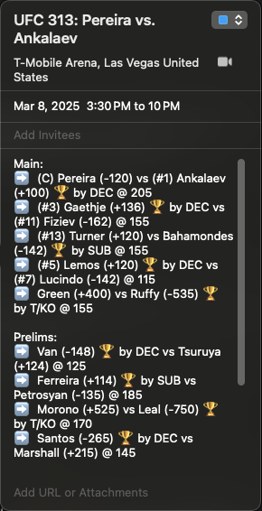

# "It's Time!"

A [calendar feed](https://wqngyn.github.io/its-time/) that keeps you informed on upcoming (and past) UFC events. The application runs every four hours via Github Actions, collects data from [UFC Events](https://www.ufc.com/events), and commits/updates an existing .ics file.

## Sample Event Screenshot

### Legend

The following emojis in the notes section denote different bout outcomes:

- 🏆: winner
- ✍🏼: draw
- 🙅🏻‍♂️: no contest

## Notes:

- The end time assumes the event ends three hours after the main event starts.

The idea for this project was inspired by Clarence Chan's [UFC Cal](https://github.com/clarencechaan/ufc-cal) which I built upon by adding betting odds, bout outcomes, and the methods by which each ended.
